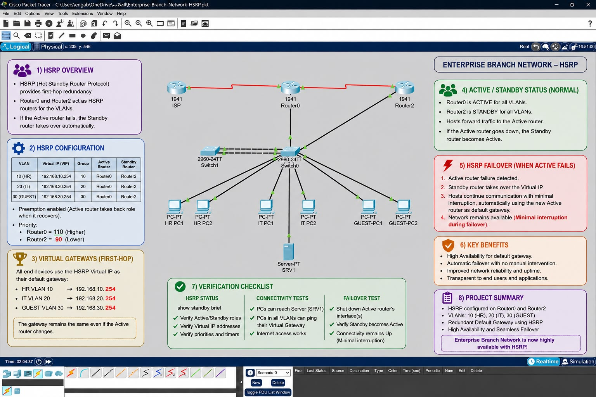

# Enterprise Branch Network – HSRP

## Project Overview

This project implements **HSRP (Hot Standby Router Protocol)** in a Cisco Packet Tracer enterprise branch network to provide **default gateway redundancy and high availability**.

The network contains multiple VLANs for HR, IT, and Guest users. Two routers participate in HSRP so that if the primary router becomes unavailable, the standby router automatically takes over the gateway role.

This project builds on the previous enterprise branch network projects and introduces **First-Hop Redundancy** using HSRP.

---

## Network Topology

The network includes:

- Router0 – Primary HSRP Router
- Router2 – Standby HSRP Router
- ISP Router
- Switch0 – Main Access Switch
- Switch1 – Secondary Switch
- HR PCs
- IT PCs
- Guest PCs
- Server (SRV1)

---

## VLAN Design

| VLAN | Department | Network |
|------|------------|---------|
| 10 | HR | 192.168.10.0/24 |
| 20 | IT | 192.168.20.0/24 |
| 30 | Guest | 192.168.30.0/24 |

---

## HSRP Configuration

HSRP provides a redundant default gateway for each VLAN.

| VLAN | HSRP Group | Virtual IP | Active Router | Standby Router |
|------|------------|------------|---------------|----------------|
| 10 – HR | 10 | 192.168.10.254 | Router0 | Router2 |
| 20 – IT | 20 | 192.168.20.254 | Router0 | Router2 |
| 30 – Guest | 30 | 192.168.30.254 | Router0 | Router2 |

### HSRP Priority

- **Router0 Priority:** 110
- **Router2 Priority:** 90
- **Preemption:** Enabled

Router0 normally operates as the **Active Router**, while Router2 operates as the **Standby Router**.

---

## HSRP Failover

The failover functionality was tested by shutting down the active Router0 interface.

During the test:

1. Router0 was initially Active.
2. Router0's interface was shut down.
3. Router2 automatically changed from Standby to Active.
4. The HSRP Virtual IP remained available.
5. Network connectivity continued through Router2.
6. Router0 was restored.
7. Because preemption is enabled, Router0 returned to the Active role.

This confirms that HSRP gateway redundancy is functioning correctly.

---

## Security Policy

The existing ACL security policy remains implemented.

Guest VLAN users are restricted from accessing the internal:

- HR VLAN
- IT VLAN

Guest users can still access permitted network resources according to the configured ACL rules.

This confirms that adding HSRP did not break the existing network security policy.

---

## Verification

The following tests were successfully performed:

### HSRP Status

Command used:

`show standby brief`

Verified:

- Router0 operates as Active during normal operation.
- Router2 operates as Standby.
- HSRP groups 10, 20, and 30 are operational.
- Virtual gateway addresses are configured correctly.
- HSRP preemption is enabled.

### Connectivity Testing

Verified connectivity between authorized devices and network resources using `ping`.

HR and IT connectivity remained operational.

Guest isolation was also tested:

- Guest → HR: Blocked
- Guest → IT: Blocked
- Guest → Permitted resources: Successful

### Failover Testing

Router0 was intentionally taken down to simulate a gateway failure.

Router2 successfully became the Active HSRP router and maintained gateway availability.

After Router0 was restored, it returned to the Active role.

---

## Technologies Used

- Cisco Packet Tracer
- VLANs
- Inter-VLAN Routing
- HSRP
- First-Hop Redundancy
- ACLs
- DHCP
- DNS
- NAT
- STP
- EtherChannel
- Network Troubleshooting
- High Availability

---

## Project Files

- `Enterprise-Branch-Network-HSRP.pkt` – Cisco Packet Tracer project file
- `Enterprise-Network-HSRP-Topology.jpg` – Network topology and HSRP project overview

---

## Key Skills Demonstrated

This project demonstrates practical experience with:

- Designing redundant enterprise networks
- Configuring HSRP
- Configuring Active and Standby gateways
- Implementing gateway failover
- Configuring HSRP priority and preemption
- Maintaining VLAN segmentation
- Maintaining ACL-based network security
- Testing network availability during failures
- Troubleshooting enterprise network connectivity

---

## Result

The enterprise branch network successfully provides **redundant default gateway services using HSRP**.

Router0 operates as the preferred Active router, while Router2 provides automatic failover capability.

The network maintains connectivity during gateway failure while preserving the existing VLAN segmentation and security policies.
